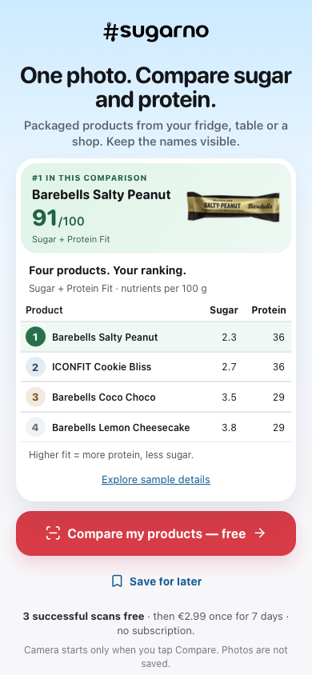

# v12 packaged-product and recovery review — 28 September 2026

Status: review candidate, not published. Production remains v11. Tested implementation commit: `5a47882d008e6744c7249016cd52e9219042f39f`, based on `b6d0a2b46439cba38e62ffc7a15818887b4d7e20`.

## Behavior

- First screen invites clear photographs of packaged products from a fridge, table or shop, preserving the four-product ranking and single free-compare CTA.
- Camera denial/unavailability exposes saved-photo selection directly. Cancelling and choosing the same file again remain possible.
- No-match explains how to improve packaging visibility and offers retake/replacement. Technical failure keeps a separate explanation and can retry the same prepared upload.
- Failed scans do not consume a successful-scan allowance. Camera/upload, sample and QA attribution remain separate. Events identify onboarding v12; legacy `in_store` means entering the real scanner, not a physical location.

## Technical checks

Cloud implementation completed in the existing Scanner environment. Cloud reported lint/typecheck and 104 Vitest files / 842 tests passing. Browser execution was blocked by missing WebKit and HTTP 403 when downloading it, so browser verification and final review ran on the Mac mini.

- `npm run verify`: passed on the implementation above: lint (one pre-existing hook-dependency warning), typecheck, 104 files / 842 tests, catalog validators, Next production build and standalone asset preparation.
- Focused Mobile Safari run: 20 passed, one feature-gated skip; two tests initially stopped at the local preview server's default authentication rate limit before their scan flow. With the repository's test rate-limit configuration, both passed; the iPhone layout matrix also passed (3/3 in 14.6 seconds).
- Covered denied/unavailable camera → clicked file picker → cancellation → same-file selection → rated upload; no-match → replacement; technical failure → retry same prepared image; quota/rate-limit recovery; onboarding and sample flow; smoke scenarios; source attribution and successful-scan allowance.
- Layout matrix: 320×568, 375×667, 390×844, 402×874, 440×956, 667×375 and 874×402. Controls reachable, images loaded and no horizontal overflow.
- Built-in browser manually confirmed the camera-unavailable panel has direct saved-photo selection.
- `git diff --check`: passed.

Local logs are retained under `test-results/2026-09-28-recovery/` (ignored). An earlier webpack-only preview generated incompatible development type artifacts; the standard Turbopack setup with independent dependencies and fresh generated artifacts passed verification. No API route implementation changed for that harness issue.

## Owner product checks

1. On a phone, open the approved preview/release and confirm the home/fridge wording and ranks 1–4 are clear.
2. In Instagram/Facebook's browser, deny camera access and choose a saved photograph directly; cancel once and retry.
3. Photograph packaged products with visible names. If no match is found, follow the guidance and select a clearer image; verify a genuine result appears without spending an allowance on the failed attempt.

Physical iPhone Instagram/Facebook checks and real-provider recognition of new fridge photographs are not established by these deterministic browser tests. No conversion improvement is claimed. Full production deployment verification must follow separate owner publication approval.
